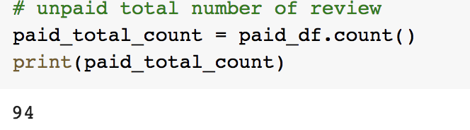

# Amazon_Vine_Analysis

## Analysis Overview
   
   The purpose of this project was to analysis Amazon Vine program and determine
   whether there is a bias toward favorable reviews from Vine members. In this analysis,
   i used PySpark to perform and extract the dataset, transform the data, connect to an
   AWS RDS instance, load the process data into pgAdmin and calculate different metrics.
   My focused was on the US reviews for video games.

## Resource
     Data Source: Amazon Review dataset, Video Games Revieew dataset
     Software used: Google Colab Notebook, PostgreSQL, pgAdmin4, AWS
    
    
## Outcome

## Total number of reviews
      
      Vine reviews 
         
